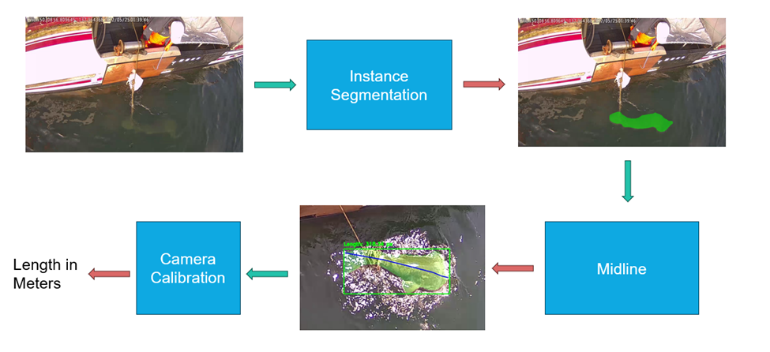
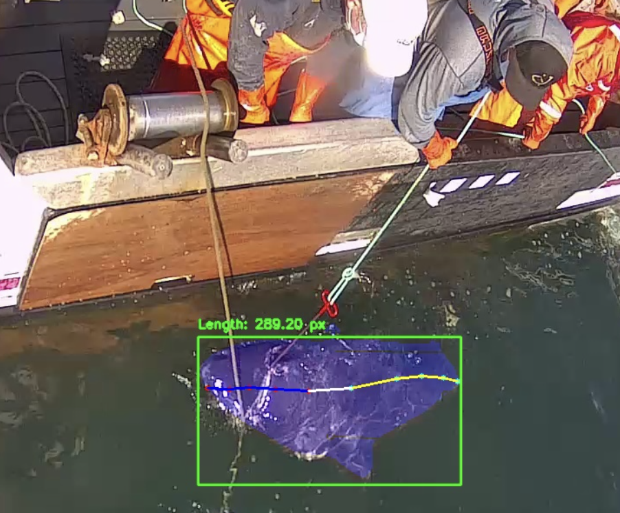
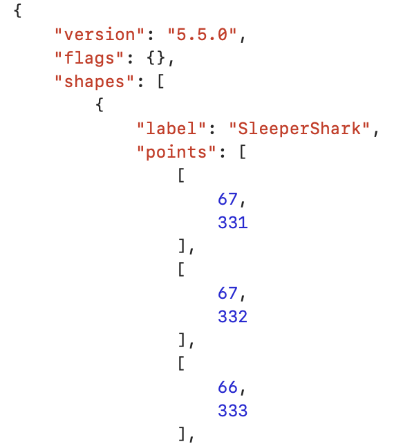
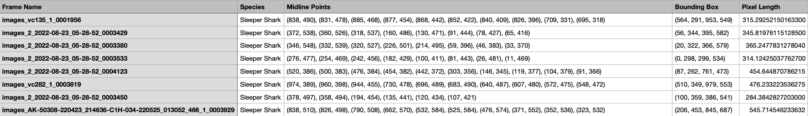

# Fish Mask Prediction and Midline Estimation

This repository contains code for generating visualization figures of mask predictions and calculating midline estimations for fish images. The pipeline uses a YOLO model for segmentation and processes the data to compute midlines, bounding boxes, and fish lengths.



## Requirements

Ensure you have **Python** (version 3.8 or higher) installed on your system. You will also need `venv` or `virtualenv` for creating a virtual environment. All other dependencies will be installed during the setup process.

## Setup

Follow these steps to set up the environment through the terminal for running the project. 

1. First, clone the repository to your local machine using the following commands:
    ```bash
    git clone <repository-url>
    cd <repository-directory>
    ```

2. Next, create a virtual environment using the following commands:
    ```bash
    python -m venv shark
    ```

    If on macOS/linux:
    ```bash
    source shark/bin/activate
    ```

    If on Windows:
    ```bash
    shark\Scripts\activate
    ```

3. With the virtual environment active (you’ll see the environment name, such as shark, displayed at the beginning of your terminal prompt), install the required Python libraries using pip using the following commands:
    ```bash
    pip install numpy opencv-python torch ultralytics imageio
    ```

## Config

The configuration file, `config.py`, is used for setting up paths and parameters that the script uses to process the fish images and generate outputs. Below is an explanation:

### Directories and Paths

- **`VIDEO_DIR`**: Defines the root directory where the input images are stored. Directions on how to structure the image files are described in the `Running the Script` section.

- **`VISUALIZE_OUTPUT_PATH`**: Defines the directory where visualized segmentation masks and midline estimations will be saved.

- **`VIDEO_OUTPUT_PATH`**: Defines the directory where videos combining processed frames will be saved.

- **`JSON_OUTPUT_PATH`**: Defines the directory where JSON metadata files will be saved. Each JSON file contains additional information, such as mask contours and fish metadata, for each processed frame.

- **`MODEL_PATH`**: Defines the path to the YOLO model file (e.g., `.pt` file).

- **`CSV_PATH`**: Defines the path to save the CSV file, which contains results, including midline points, bounding boxes, and pixel lengths.

### Flags

- **`VISUALIZE_FLAG`**: Enables or disables the visualization of segmentation masks and midlines. If set to `False`, the script will not generate visual output files.
- **`VIDEO_FLAG`**: Enables or disables video generation. If set to `False`, the script will skip creating videos from the processed frames.
- **`JSON_FLAG`**: Enables or disables the saving of JSON metadata for each frame. If set to `False`, JSON files will not be created.

## Running the Script

Make sure your input data (fish images) is placed in the VIDEO_DIR directory (specified by the config file), organized into subfolders. Each subfolder represents a separate set of images or a video clip. The video file structure should look like this:
```bash
VIDEO_DIR/
├── video_clip_1/
│   ├── image_001.jpg
│   ├── image_002.jpg
│   ├── image_003.jpg
│   └── ...
├── video_clip_2/
│   ├── image_001.jpg
│   ├── image_002.jpg
│   ├── image_003.jpg
│   └── ...
├── video_clip_3/
│   ├── image_001.jpg
│   ├── image_002.jpg
│   ├── image_003.jpg
│   └── ...
└── ...
```

Run the script with the virtual environment activated:
```bash
python main.py
```

## Outputs
The following outputs will be generated (based on what flags you set in the config file):

- **Visualization Images**: Segmentation masks and midline estimations overlaid on the original images. These will be saved in the `VISUALIZE_OUTPUT_PATH` directory.
  

- **Videos**: Generated videos combining processed frames to show the segmentation and midline estimation in motion. These will be saved in the `VIDEO_OUTPUT_PATH` directory.

- **JSON Files**: Metadata for each processed frame, including mask contours and fish information. These will be saved in the `JSON_OUTPUT_PATH` directory.
  

- **CSV File**: A file containing detailed results for each frame, including midline points, bounding boxes, and pixel lengths. This will be saved in the `CSV_PATH`.
  