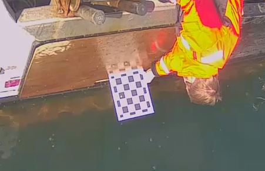
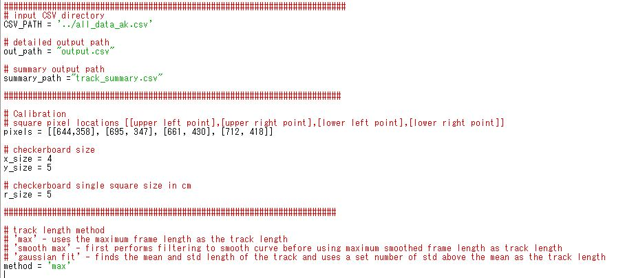
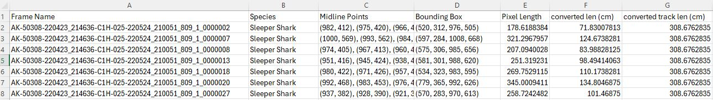
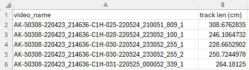

# Midline pixel length to real world length 
Run the following command for length conversion
```bash
python calibration.py
```
## Calibration image example
In order to convert the pixel length to real world length, we need to use a calibration pattern of known size.  The preferred calibration image would have a checkerboard pattern held parallel to and as close to the water surface as possible, like below.

## Calibration config
For calibration, we have three sets of configuration parameters.  First are the input and output paths. Next are the parameters for the checkboard pattern used for calibration.  Finally, we have the method used to determine overall track length.


## Input
We use the csv file output from the main program as input 

## Output
We have two outputs.  One is the input csv with two additional columns, the frame real world length and the track real world length.  The second output is a summary csv file with only the video/track name and corresponding track length

